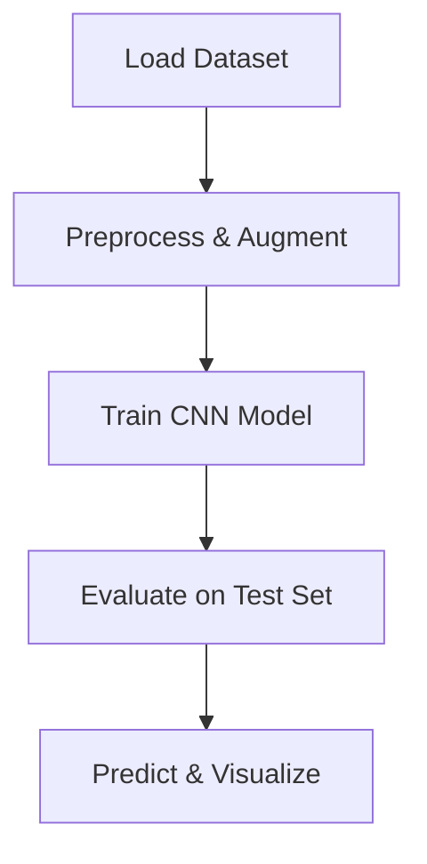

# 🚘 Traffic Sign Detection with Deep Learning

Welcome to the **Traffic Sign Detection** project! This repository showcases a deep learning model built to **detect and classify traffic signs** from images, helping move one step closer to safer autonomous driving systems.

---

## 📖 About the Project

Traffic signs are essential for maintaining road safety. This project uses **Convolutional Neural Networks (CNNs)** to automatically recognize and classify traffic signs from real-world images, trained on the **German Traffic Sign Recognition Benchmark (GTSRB)** dataset.

---

## 🧾 Features

✨ Detect and classify 43 different types of traffic signs  
📊 Trained on 50,000+ labeled images  
📦 Easy-to-use, modular code structure  
💡 Built with modern deep learning practices  
📸 Can be extended for real-time detection

---

## 🗃️ Dataset Used

**📍 Name**: [GTSRB - German Traffic Sign Recognition Benchmark](https://benchmark.ini.rub.de/?section=gtsrb&subsection=dataset)  
**📸 Images**: 50,000+  
**🔢 Classes**: 43 unique traffic sign categories  
**🖼️ Preprocessing**: Resized images to 32x32 or 64x64, normalization, augmentation

---

## 🧰 Tech Stack

| Tool         | Usage                          |
|--------------|--------------------------------|
| Python 🐍     | Core programming language       |
| TensorFlow/Keras 🧠 | Deep learning framework      |
| OpenCV 📷     | Image processing               |
| NumPy / Pandas 📊 | Data handling & manipulation |
| Matplotlib 📈 | Visualizing training results   |

---

## 🧠 Model Summary

The model uses a standard CNN architecture with:

- Conv2D layers + ReLU activation  
- MaxPooling layers  
- Dropout for regularization  
- Dense layers + Softmax output

🧪 Optionally tested with **ResNet / MobileNet** for higher accuracy.

---

## 🔄 Workflow



---

## 📈 Performance

| Metric         | Value (Example) |
|----------------|-----------------|
| Training Accuracy | 98.3%          |
| Validation Accuracy | 94.7%       |
| Test Accuracy   | 93.5%           |

✅ Add your own results here!

---

## 🧪 Sample Output

```plaintext
🛑 Actual: Stop Sign       → Predicted: Stop Sign ✅
⚠️  Actual: Road Work       → Predicted: Road Work ✅
🚫 Actual: No Entry         → Predicted: Yield ❌
```

You can also embed images here of predictions using ``.

---

## 🛠️ How to Use

1. **Clone the Repository**
   ```bash
   git clone https://github.com/yourusername/traffic-sign-detection.git
   cd traffic-sign-detection
   ```

2. **Install Requirements**
   ```bash
   pip install -r requirements.txt
   ```

3. **Train the Model**
   ```bash
   python train.py
   ```

4. **Test or Predict**
   ```bash
   python predict.py
   ```

---

## 🧭 Future Scope

- [ ] Real-time detection from webcam/live video
- [ ] Convert to mobile app using TensorFlow Lite
- [ ] Improve accuracy with ensemble models
- [ ] Integrate with Raspberry Pi for deployment

---

## 🙏 Acknowledgements

- [GTSRB Dataset](https://benchmark.ini.rub.de/?section=gtsrb&subsection=dataset)
- TensorFlow / Keras / PyTorch teams
- OpenCV Community

---

⭐ If you found this helpful, consider giving the repo a **star**!  
🛠️ Built with passion by **Kuna**.

